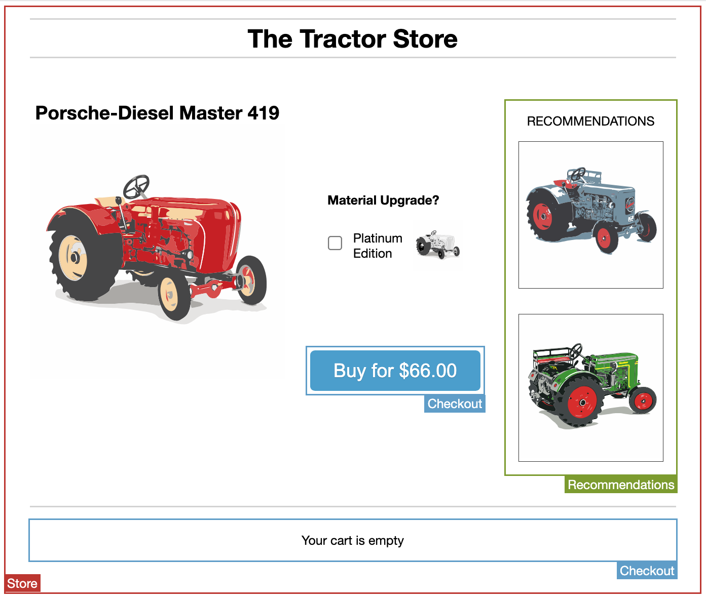

# TAP recipe: Monolith to Microservices

This repository is used as a playground to experiment with Tanzu Application Platform (TAP) by modernising a thin slice
of a monolithic application into a microservice.

# TODO

- [x] Setup a walking skeleton (frontend, backend, database, e2e)
- [x] Port the product details capability of the [Tractor Store](https://the-tractor.store/)
- [x] Port the shopping cart capability of the [Tractor Store](https://the-tractor.store/)
    - [x] Present the price of a product
    - [x] Put one or more products into the shopping cart
    - [x] Different price for platinum editions
    - [x] Empty the shopping cart
- [x] Port the recommendations capability of the [Tractor Store](https://the-tractor.store/)
- [ ] Complete the checkout flow
    - [ ] Review the shopping cart
    - [ ] Pay for the order
    - [ ] Receive order Confirmation
